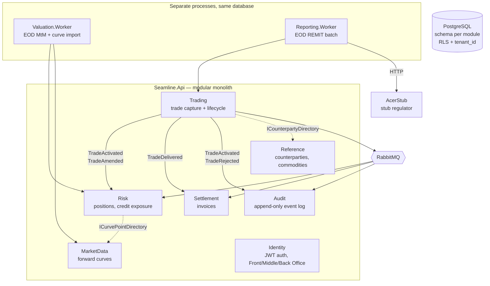
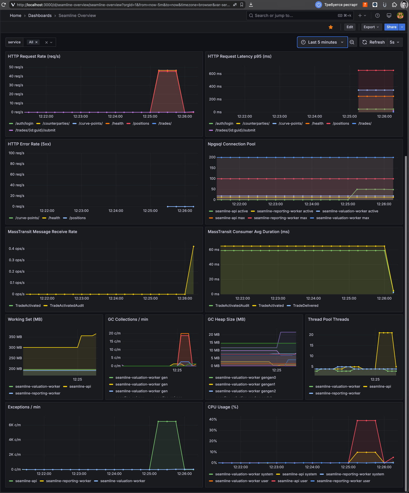
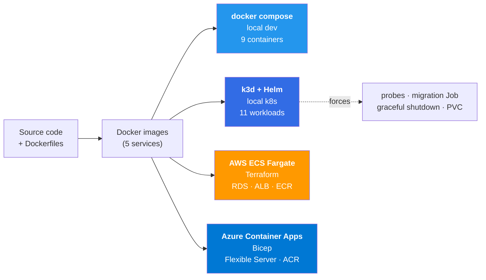

# Seamline
_mini SaaS CTRM demo project_

[](https://github.com/TropinAlexey/seamline/actions/workflows/ci.yml)
[](https://github.com/TropinAlexey/seamline/actions/workflows/deploy.yml)


<br clear="left"/>

Multi-tenant commodity trading & risk platform (mini-CTRM) for power and gas
forwards in .NET 10 — modular monolith with boundaries enforced in CI,
two services extracted on purpose, four deploy targets (docker compose,
local k8s via Helm, AWS ECS via Terraform, Azure Container Apps via Bicep).

**All five phases complete.** 220 tests, 27 ADRs, one pipeline to both clouds.

> Simplified for demonstration; not a compliant REMIT implementation.
> Clean-room implementation. No code, schemas, or business rules from any
> employer or commercial CTRM product.

## Running locally

Two options: **docker compose** (below) for quick dev, or **[k3d + Helm](#local-kubernetes-k3s)**
for a single-node Kubernetes demo (probes, migration Job, observability pipeline —
not production-ready, see [known limitations](#known-limitations)).

```bash
# Full stack (all 9 services):
docker compose up -d

# Or individual processes against a local Postgres + RabbitMQ:
docker compose up -d postgres rabbitmq acer-stub
dotnet run --project src/Seamline.Api                # migrates every module's schema on startup
dotnet run --project src/Seamline.Valuation.Worker    # optional — EOD MtM + curve import
dotnet run --project src/Seamline.Reporting.Worker    # optional — EOD REMIT batch

# Build and test:
dotnet build SeamlineCtrm.sln
dotnet test SeamlineCtrm.sln
```

Once running, these are available on localhost:

| Service | URL | Notes |
|---|---|---|
| API | http://localhost:5000 | All endpoints ([see API table](#api)) |
| Health check | http://localhost:5000/health | 200/503 for load balancers |
| Health detail | http://localhost:5000/health/detail | Per-check JSON (status, latency) |
| Grafana | http://localhost:3000 | Anonymous viewer, admin/admin |
| Prometheus | http://localhost:9090 | Raw metrics query UI |
| OTel Collector | http://localhost:4317 (gRPC), :4318 (HTTP) | OTLP receiver |
| RabbitMQ Management | http://localhost:15672 | guest / guest |
| PostgreSQL | localhost:5432 | seamline / seamline |

`POST /auth/login` with `{"tenantId": "11111111-1111-1111-1111-111111111111",
"login": "trader", "password": "Demo-Password-123!"}` (or `risk`/`backoffice`
for the MO/BO demo users) returns a JWT — every other endpoint requires
`Authorization: Bearer <token>`. See [ADR-0013](docs/adr/0013-identity-custom-jwt-auth.md).

Curve import ([ADR-0018](docs/adr/0018-curve-import.md)) uses a synthetic
price source by default — no configuration needed. To opt a commodity into
a real source, add the keys to `appsettings.json` (or
`appsettings.Development.json` / environment variables / `dotnet user-secrets`):

```jsonc
// appsettings.Development.json
{
  "MarketData": {
    "CurveImport": {
      "Sources": { "POWER": "EntsoE" },   // or "GAS": "Eia"
      "EntsoE":  { "ApiToken": "<free ENTSO-E Transparency Platform token>" },
      "Eia":     { "ApiKey":   "<free EIA Open Data API key>" }
    }
  }
}
```

## Architecture



- Solid arrows = MassTransit integration events (via RabbitMQ). Dotted = in-process query interfaces (DI).
- Module boundaries enforced by [57 architecture tests](#testing-strategy) in CI, not by convention.
- Multi-tenant: shared schema + `tenant_id` global filter + PostgreSQL RLS, tenant claim in JWT.
- Transactional outbox ([ADR-0004](docs/adr/0004-transactional-outbox.md)): events written in the same DB transaction as business data — no dual-write risk.
- Credit-limit concurrency: `pg_advisory_xact_lock` per counterparty serializes concurrent trade submissions so two traders cannot silently double-breach a limit ([ADR-0027](docs/adr/0027-credit-reservation-concurrency.md)).
- Hangfire schedules EOD jobs in both workers, each in its own schema (`hangfire_valuation`, `hangfire_reporting`) — see [ADR-0003](docs/adr/0003-hangfire-vs-masstransit-scheduling.md).
- CI/CD: one GitHub Actions pipeline deploys to both clouds via OIDC — no stored credentials ([ADR-0024](docs/adr/0024-github-actions-federation.md)).

Each module is two projects — `Seamline.Modules.<Name>` (implementation,
`internal` types) and `Seamline.Modules.<Name>.Contracts` (public DTOs,
query interfaces, integration events). A module's implementation can never
reference another module's implementation — enforced by architecture tests
in CI, not by convention.

Two components are extracted from the monolith on purpose:
`Valuation.Worker` (end-of-day MtM) and `Reporting.Worker` (simplified
REMIT submission). Both share the same PostgreSQL database — this is
service-based architecture, not database-per-service. Each is a second
composition root hosting the same module code. See
[ADR-0001](docs/adr/0001-modular-monolith.md)/[ADR-0002](docs/adr/0002-service-extraction-criteria.md)
for extraction criteria, [ADR-0014](docs/adr/0014-valuation-worker.md)/[ADR-0015](docs/adr/0015-reporting-worker.md)
for what each worker computes.

## Scope boundaries

- Physical forwards only, power and gas. No options.
- Monthly delivery periods only.
- Mark-to-market: `(forward_price − trade_price) × volume`. Flat monthly
  curve points — no interpolation, shaping, or cascading.
- No VaR. Stress scenarios instead ([ADR-0016](docs/adr/0016-stress-scenarios.md)):
  a flat ±10% shock across every curve, and a sharper ±25% shock isolated
  to a position's own commodity — fixed magnitudes, not user-configurable.
- REMIT: simplified XML against `Seamline.AcerStub`, a stub regulator
  endpoint — not a compliant REMIT/ACER implementation. See
  [ADR-0015](docs/adr/0015-reporting-worker.md).
- Auth ([ADR-0013](docs/adr/0013-identity-custom-jwt-auth.md)): JWT signing
  key lives in `appsettings.json` as a static dev-only secret, not a real
  secrets store — fine for a local/demo project, explicitly not a
  production posture. Three demo users (one per FO/MO/BO role) are seeded
  by the `Identity` module's `InitialCreate` migration with a documented
  password (`Demo-Password-123!`) for a fixed demo tenant
  (`11111111-1111-1111-1111-111111111111`).

## API

All endpoints require `Authorization: Bearer <token>` unless noted.
OpenAPI spec is available at `/openapi/v1.json` in development mode.

| Method | Path | Role | Description |
|---|---|---|---|
| `POST` | `/auth/login` | anonymous | Returns JWT |
| `GET` | `/counterparties/` | FO | List counterparties |
| `POST` | `/counterparties/` | FO | Create counterparty |
| `GET` | `/trades/` | FO | List trades |
| `POST` | `/trades/` | FO | Create trade (draft) |
| `POST` | `/trades/{id}/submit` | FO | Submit draft → credit check |
| `POST` | `/trades/{id}/approve` | MO | Approve credit-pending trade |
| `POST` | `/trades/{id}/reject` | MO | Reject credit-pending trade |
| `POST` | `/trades/{id}/amend` | FO | Amend active trade (new version) |
| `POST` | `/trades/{id}/deliver` | FO | Mark trade as delivered |
| `POST` | `/trades/{id}/cancel` | FO | Cancel trade |
| `GET` | `/positions` | FO, MO | MtM positions per commodity × period |
| `GET` | `/invoices` | BO | Settlement invoices |
| `GET` | `/curve-points/` | FO | List forward curve points |
| `POST` | `/curve-points/` | FO | Upsert curve point |
| `GET` | `/stress-scenarios` | MO | Stress scenario results |
| `GET` | `/health` | anonymous | Aggregate health (200/503) |
| `GET` | `/health/detail` | anonymous | Per-check JSON (status, latency) |

## Testing strategy

220 tests across three layers:

| Layer | Count | What it covers |
|---|---|---|
| Unit (Trading, Risk, Identity, MarketData) | 110 | Domain logic: trade state machine, MtM calculation, credit reservation, saga transitions, password hashing, curve import |
| Architecture | 69 | Module boundaries, no cross-schema FKs, no cloud SDK in modules, decimal-only money, internal-by-default, MassTransit version pin, no MediatR, explicit rounding, EF Core defaults convention, saga placement |
| Integration | 41 | Full HTTP pipeline per module: auth → endpoint → EF Core → Postgres (Testcontainers), MassTransit consumers, transactional outbox delivery, credit-limit concurrency, append-only grant enforcement (audit, trade_history, remit_report, invoice), RLS tenant isolation on audit |

**What's deliberately not covered:** no contract tests between modules
(arch tests enforce the boundary; contracts are DTOs with no logic to test);
no E2E browser tests (no UI); saga timeout paths are unit-tested with
MassTransit's test harness, not in integration (the timeout is a
`Schedule<>` concern, not an HTTP concern).

<details><summary>Example: what an architecture test looks like</summary>

```csharp
[Theory]
[MemberData(nameof(Modules))]
public void Module_implementation_must_not_depend_on_another_modules_implementation(string moduleName)
{
    var assembly = Assembly.Load($"Seamline.Modules.{moduleName}");

    var otherModuleImplNamespaces = ModuleNames
        .Where(name => name != moduleName)
        .Select(name => $"Seamline.Modules.{name}.Internal")
        .ToArray();

    var result = Types.InAssembly(assembly)
        .Should()
        .NotHaveDependencyOnAny(otherModuleImplNamespaces)
        .GetResult();

    Assert.True(result.IsSuccessful,
        $"{moduleName} depends directly on another module's implementation: " +
        string.Join(", ", result.FailingTypeNames ?? []));
}
```
_(verbatim from `tests/Seamline.ArchTests/ModuleBoundaryTests.cs`)_

That's one of twelve rules enforced on every build:

| Rule | Where it's stated |
|---|---|
| A module's implementation never depends on another module's implementation | `CLAUDE.md` |
| A `.Contracts` assembly never depends on any implementation | `CLAUDE.md` |
| A `.Contracts` assembly depends on nothing but `SharedKernel` | `CLAUDE.md` |
| Money and volume fields are never `double`/`float` | `CLAUDE.md`, [ADR-0007](docs/adr/0007-decimal-rounding.md) |
| An implementation assembly exposes nothing public beyond its DI/endpoint composition root | `CLAUDE.md` |
| No migration adds a foreign key across module schemas | `CLAUDE.md` |
| No module or `.Contracts` assembly references `AWSSDK.*` or `Azure.*` packages | [ADR-0021](docs/adr/0021-portability-enforced-in-ci.md) |
| MassTransit pinned to 8.5.10 — no 9.x (commercial license) | [ADR-0009](docs/adr/0009-masstransit-version-pin.md) |
| No MediatR in any project | `CLAUDE.md` |
| `Math.Round` always specifies `MidpointRounding` | [ADR-0007](docs/adr/0007-decimal-rounding.md) |
| `HasDefaultValueSql`/`HasDefaultValue` paired with `ValueGeneratedNever()` | `CLAUDE.md` |
| Saga types live in owning module's impl assembly, not in Contracts or hosts | [ADR-0008](docs/adr/0008-saga-placement-and-ownership.md) |

The cross-schema FK test runs each migration's `Up()` against a real
`MigrationBuilder` and inspects the resulting operations — including foreign
keys declared inline inside `CreateTable`, which don't show up as a
top-level operation.

</details>

## Load testing

`scripts/load-test.sh` exercises the full trade lifecycle across multiple
tenants concurrently: counterparty → trade → submit → credit check →
approve/reject → amend → deliver → invoice, with mid-run EOD curve repricing
and cross-tenant isolation verification.

```bash
# quick check (~10s, 300 trades)
docker compose up -d && ./scripts/load-test.sh

# staircase to saturation (~20 min, 18K trades) — open Grafana at localhost:3000
docker compose up -d && ./scripts/load-test.sh --ramp

# scale up: 10 tenants, 500 trades each, concurrency 40
docker compose up -d && ./scripts/load-test.sh --tenants 10 --trades 500 --concurrency 40

# CI smoke (1 trade, exits non-zero on failure)
./scripts/load-test.sh --smoke
```

Prerequisites: `curl`, `psql`, `python3`. On Windows use WSL.

`--ramp` runs a four-phase staircase with 15s cooldowns between phases
so Grafana renders clean steps:

| Phase | Trades/tenant | Concurrency | Purpose |
|---|---|---|---|
| 1: warm-up | 10 | 5 | Baseline floor for all panels |
| 2: normal | 100 | 15 | Typical business day, no contention |
| _EOD repricing_ | — | — | _All curve points updated (market close)_ |
| 3: high | 1000 | 30 | Latency inflection, pool approaching max |
| _Curve correction_ | — | — | _POWER prices fixed post-valuation (re-run scenario)_ |
| 4: stress | 5000 | 50 | Saturation + live market curve churn in background |

Each trade lifecycle exercises all three user roles (FO books, MO
approves/rejects, BO reads invoices) with realistic chaos: 30% amended,
40% delivered, 20% credit-rejected, 5% cancelled mid-flight. All
parameters are combinable (`--ramp --tenants 10 --concurrency 40`).



Staircase result: throughput saturates at Phase 4 (37 → 13 req/s),
p95 latency inflects to 5–7s. At 50 concurrent clients the connection pool
exhausts intentionally — the test pushes past saturation to confirm
graceful degradation: errors plateau (no cascade), and all metrics return
to baseline within seconds after the burst.

## Observability

All processes emit OpenTelemetry traces and metrics via OTLP
([ADR-0025](docs/adr/0025-observability-stack.md)):

| Signal | Sources |
|---|---|
| Traces | ASP.NET Core, HttpClient, Npgsql, MassTransit |
| Metrics | HTTP request rate/latency/errors, Npgsql connection pool (active/idle/pending), MassTransit consumer duration/receive rate, .NET runtime (GC, heap, working set, thread pool, exceptions, CPU) |
| Health checks | `/health` (aggregate, for load balancers), `/health/detail` (per-check JSON, for dashboards) |

Grafana ships pre-provisioned at `localhost:3000` with a 12-panel
**Seamline Overview** dashboard. All panels respond to the `$service`
dropdown.

## Deploy



Infrastructure is defined three ways — local Kubernetes (Helm), AWS
(Terraform), and Azure (Bicep):

- **`k8s/seamline/`** (Helm): single-node k3d/k3s cluster, 11 workloads
  across two namespaces, full observability pipeline. See [Local Kubernetes](#local-kubernetes-k3s).
- **`infra/aws/`** (Terraform): VPC, RDS PostgreSQL 17.5, ECS Fargate
  (5 services), ALB, ECR, Secrets Manager, GitHub OIDC provider.
- **`infra/azure/`** (Bicep): PostgreSQL Flexible Server, Container Apps,
  ACR, Key Vault, Service Bus, Log Analytics, Entra federated credential.

One GitHub Actions pipeline, OIDC into both clouds, no stored credentials.
Both deploy steps are defined but disabled until infrastructure is
provisioned.

**Migrations** run at startup — each module calls `MigrateAsync()` before
the app accepts traffic. With multiple instances, EF Core's migration lock
(`__EFMigrationsHistory`) serializes execution. In production, a dedicated
migration job (or init container) would run before the rolling deploy
to avoid the startup penalty and remove `ALTER TABLE` permissions from
the runtime identity.

Multi-stage Dockerfiles keep images lean (`aspnet:10.0`). A full
`docker compose up` starts all nine services locally.

## Local Kubernetes (k3s)

A single-node k3s cluster deploys the entire system via a Helm chart.
Purpose: force every Kubernetes design question (probes, migration ordering,
graceful shutdown, PVC lifecycle) that ECS abstracts away. See
[ADR-0026](docs/adr/0026-local-k3s-deployment.md).

### Prerequisites

- Docker Desktop (builds images; required on macOS and Windows, typical on Linux)
- k3d — runs k3s inside Docker, works on all three platforms:
  - **macOS:** `brew install k3d`
  - **Windows:** `choco install k3d` or `winget install k3d` (run bootstrap in WSL or Git Bash)
  - **Linux:** `curl -s https://raw.githubusercontent.com/k3d-io/k3d/main/install.sh | bash`, or native k3s (`curl -sfL https://get.k3s.io | sh -`) + `export KUBECONFIG=/etc/rancher/k3s/k3s.yaml`
- kubectl, Helm 3

### Quick start

```bash
./k8s/scripts/bootstrap.sh
```

Add to hosts file: `127.0.0.1 seamline.local grafana.seamline.local jaeger.seamline.local`
(`/etc/hosts` on macOS/Linux, `C:\Windows\System32\drivers\etc\hosts` on Windows)

### What it deploys

| Workload | Kind | Namespace |
|---|---|---|
| `seamline-api` | Deployment + Service + Ingress | `seamline` |
| `seamline-valuation-worker` | Deployment | `seamline` |
| `seamline-reporting-worker` | Deployment | `seamline` |
| `seamline-acer-stub` | Deployment + Service | `seamline` |
| `postgres` | StatefulSet + PVC | `seamline` |
| `rabbitmq` | Deployment | `seamline` |
| `otel-collector` | Deployment + Service | `seamline-observability` |
| `jaeger` | Deployment + Service + Ingress | `seamline-observability` |
| `prometheus` | Deployment + Service | `seamline-observability` |
| `grafana` | Deployment + Service + Ingress | `seamline-observability` |
| `kube-state-metrics` | Deployment + Service | `seamline-observability` |

### Verify

```bash
kubectl get pods -n seamline                          # all Ready
curl http://seamline.local/health                     # 200
open http://jaeger.seamline.local                     # traces
open http://grafana.seamline.local                    # metrics (admin/admin)
```

### Logs

```bash
kubectl logs -f deployment/seamline-api -n seamline
kubectl logs -f deployment/seamline-valuation-worker -n seamline
kubectl logs -f deployment/seamline-reporting-worker -n seamline
```

### Teardown

```bash
./k8s/scripts/teardown.sh
```

### Known limitations

Single node, single replica — no HA, no HPA, no network policies.
No TLS. Observability data is ephemeral. Not in CI.

## Security considerations

This is a demo project with deliberate simplifications — stated here
rather than hidden:

| What | Status | Production upgrade |
|---|---|---|
| JWT signing key | Static in `appsettings.json` | Azure Key Vault / AWS Secrets Manager + rotation |
| Password hashing | PBKDF2-SHA256, 100K iterations | Argon2id (or ASP.NET Identity) |
| Role-based auth | FO/MO/BO via JWT claim, fallback policy requires auth | Fine-grained permissions, RBAC middleware |
| Multi-tenant isolation | EF Core global filter + PostgreSQL RLS | Same — this is production-grade |
| Health detail endpoint | Anonymous, exception text hidden in prod | Behind auth or removed; export to Prometheus instead |
| HTTPS | `UseHttpsRedirection()` in pipeline | TLS termination at ALB/App Gateway |
| Rate limiting | None | ASP.NET `RateLimiter` middleware |
| Audit trail | Append-only, `SELECT`/`INSERT` grants only | Same — this is production-grade |
| Stored credentials | None — OIDC workload identity federation | Same |

## Status

| Phase | Focus | Highlights |
|---|---|---|
| 1 — skeleton | Module boundaries, domain, multi-tenancy | 7 arch-test rules in CI; credit-limit saga ([ADR-0008](docs/adr/0008-saga-placement-and-ownership.md)); full trade lifecycle ([ADR-0011](docs/adr/0011-trade-lifecycle-extension.md)); EF Core filter + PostgreSQL RLS ([ADR-0005](docs/adr/0005-multi-tenancy.md)); JWT FO/MO/BO roles ([ADR-0013](docs/adr/0013-identity-custom-jwt-auth.md)) |
| 2 — async | Workers, real market data, RabbitMQ | `Valuation.Worker` EOD MtM ([ADR-0014](docs/adr/0014-valuation-worker.md)); `Reporting.Worker` REMIT ([ADR-0015](docs/adr/0015-reporting-worker.md)); stress scenarios ([ADR-0016](docs/adr/0016-stress-scenarios.md)); RabbitMQ transport ([ADR-0017](docs/adr/0017-rabbitmq-transport.md)); ENTSO-E/EIA curve import ([ADR-0018](docs/adr/0018-curve-import.md)); MtM-based credit exposure |
| 3 — deploy (AWS) | Docker, Terraform, CI/CD | Multi-stage Dockerfiles, `docker-compose.yml` (9 services); Terraform VPC/RDS/ECS/ALB/ECR; GitHub Actions OIDC → ECR push |
| 4 — docs & polish | Architecture diagram, ADR consistency | Mermaid diagram, README structure, ADR style pass |
| 5 — Azure | Cloud portability lane | Bicep infra ([ADR-0023](docs/adr/0023-container-apps-and-bicep.md)); Azure Service Bus transport ([ADR-0020](docs/adr/0020-azure-service-bus-transport.md)); Azure Functions Timer trigger ([ADR-0022](docs/adr/0022-serverless-valuation-trigger.md)); portability arch-test ([ADR-0021](docs/adr/0021-portability-enforced-in-ci.md)); one pipeline, both clouds ([ADR-0024](docs/adr/0024-github-actions-federation.md)) |
| — k8s | Local Kubernetes | Helm chart, k3d bootstrap, health probes (liveness/readiness/startup), migration Job, graceful shutdown, OTel Collector → Jaeger pipeline ([ADR-0026](docs/adr/0026-local-k3s-deployment.md)) |

The code delta between AWS and Azure is one thing: the MassTransit transport
branch (`InMemory` | `RabbitMq` | `AzureServiceBus`). Everything else —
secrets, compute, database, telemetry — is platform-abstracted or identical,
enforced by an architecture test that fails the build if any `AWSSDK.*` or
`Azure.*` package leaks into a module assembly ([ADR-0021](docs/adr/0021-portability-enforced-in-ci.md)).

<details><summary>ADRs (26 decisions)</summary>

| ADR | Topic |
|---|---|
| [0001](docs/adr/0001-modular-monolith.md) | Modular monolith instead of microservices |
| [0002](docs/adr/0002-service-extraction-criteria.md) | Extracting a process without extracting a database |
| [0003](docs/adr/0003-hangfire-vs-masstransit-scheduling.md) | Hangfire vs MassTransit `Schedule<>`: instance timeout vs recurring work |
| [0004](docs/adr/0004-transactional-outbox.md) | Transactional outbox for published events |
| [0005](docs/adr/0005-multi-tenancy.md) | Multi-tenancy: shared schema + `tenant_id`, not database-per-tenant |
| [0006](docs/adr/0006-audit-trail-instead-of-event-sourcing.md) | Versioned append-only history instead of Event Sourcing |
| [0007](docs/adr/0007-decimal-rounding.md) | `decimal` for money and volume, explicit rounding |
| [0008](docs/adr/0008-saga-placement-and-ownership.md) | Credit-limit saga: lives in Trading, only engages on a limit breach |
| [0009](docs/adr/0009-masstransit-version-pin.md) | MassTransit pinned to 8.5.10 — 9.x requires a commercial license |
| [0010](docs/adr/0010-audit-module-placement.md) | Audit module placement: a pure sink, never publishes |
| [0011](docs/adr/0011-trade-lifecycle-extension.md) | Trade lifecycle: `Cancelled`/`Amended`/`Delivered` |
| [0012](docs/adr/0012-marketdata-settlement-first-entities.md) | MarketData and Settlement's first entities |
| [0013](docs/adr/0013-identity-custom-jwt-auth.md) | Identity: custom JWT auth, Front/Middle/Back Office roles |
| [0014](docs/adr/0014-valuation-worker.md) | Valuation.Worker: real mark-to-market |
| [0015](docs/adr/0015-reporting-worker.md) | Reporting.Worker: simplified REMIT submission |
| [0016](docs/adr/0016-stress-scenarios.md) | Stress scenarios instead of VaR: flat and single-commodity shocks |
| [0017](docs/adr/0017-rabbitmq-transport.md) | RabbitMQ transport, config-driven; in-memory transport for tests |
| [0018](docs/adr/0018-curve-import.md) | Curve import: real free day-ahead sources (ENTSO-E, EIA), synthetic default |
| [0019](docs/adr/0019-cloud-portability-strategy.md) | Cloud portability: differences live in IaC and config, never in code |
| [0020](docs/adr/0020-azure-service-bus-transport.md) | Azure Service Bus as a config-selected MassTransit transport |
| [0021](docs/adr/0021-portability-enforced-in-ci.md) | Portability enforced in CI: no cloud SDK in module assemblies |
| [0022](docs/adr/0022-serverless-valuation-trigger.md) | Serverless trigger: Azure Function Timer as an alternative to Hangfire |
| [0023](docs/adr/0023-container-apps-and-bicep.md) | Container Apps (not AKS) and Bicep alongside Terraform |
| [0024](docs/adr/0024-github-actions-federation.md) | GitHub Actions with workload identity federation, not Azure DevOps |
| [0025](docs/adr/0025-observability-stack.md) | Observability: vanilla OTel SDK + OTLP, ADOT sidecar on AWS, App Insights on Azure |
| [0026](docs/adr/0026-local-k3s-deployment.md) | Local k3s deployment: Helm chart, probes, migration Job, graceful shutdown |
| [0027](docs/adr/0027-credit-reservation-concurrency.md) | Credit reservation concurrency: `pg_advisory_xact_lock` per counterparty |

</details>
